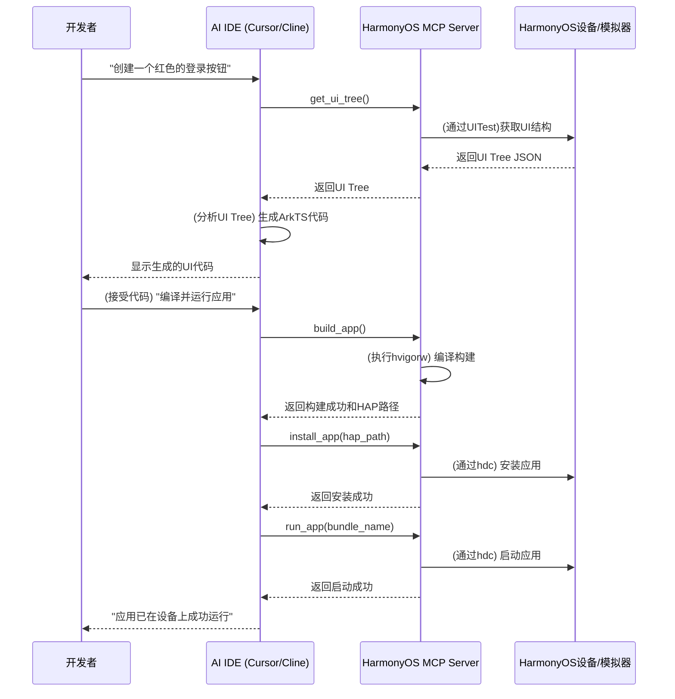

# HarmonyOS端到端AI开发工作流程

本文档详细描述了基于自定义HarmonyOS MCP（Model Context Protocol）工具的端到端AI辅助开发工作流程。该流程旨在为开发者提供一个无缝、高效且智能的HarmonyOS应用开发体验。

## 1. 核心理念

该工作流程的核心是将开发者从繁琐的、重复性的任务中解放出来，让他们能够专注于业务逻辑和创新。通过自然语言与AI Agent交互，开发者可以驱动整个开发、构建、测试和部署的生命周期。

**流程可视化**:


## 2. 工作流程详解

### 阶段一：环境设置 (一次性)

在开始AI辅助开发之前，需要进行一次性的环境配置。

1.  **安装AI IDE**：
    -   安装 [Cursor](https://cursor.sh/) 或在VS Code中安装 [Cline](https://marketplace.visualstudio.com/items?itemName=cline.cline) 插件。

2.  **设置HarmonyOS MCP Server**：
    -   从代码仓库克隆`harmonyos-mcp-server`项目到本地。
    -   安装Python依赖：`pip install -r requirements.txt`。

3.  **配置IDE与MCP Server的连接**：
    -   在HarmonyOS项目根目录下，创建`.cursor/mcp.json`文件。
    -   配置MCP服务器的启动命令，如下所示：
        ```json
        {
          "mcpServers": {
            "harmonyos-tools": {
              "command": "python",
              "args": ["/path/to/your/harmonyos-mcp-server/mcp_server.py"],
              "env": {
                "HARMONYOS_SDK_PATH": "/path/to/your/harmonyos/sdk"
              }
            }
          }
        }
        ```

4.  **创建HarmonyOS项目**：
    -   使用DevEco Studio创建一个新的HarmonyOS应用项目。

5.  **集成UI感知模块**：
    -   将用于提供UI树的`ui-tree-provider`模块（一个包含HTTP服务的HAR包）集成到目标应用中。
    -   在应用的`oh-package.json5`中添加依赖，并在应用启动时初始化该服务。

### 阶段二：AI辅助开发循环

这是日常开发的核心循环，一个功能从需求到实现通常经过以下步骤。

**场景：开发一个用户登录界面**

1.  **需求描述 (UI开发)**：
    -   **开发者**：在IDE的聊天窗口中输入 `"@harmonyos-tools 在界面上创建一个垂直布局，包含一个手机号输入框、一个密码输入框和一个红色的登录按钮。"`
    -   **AI Agent**：
        1.  调用`get_ui_tree()`工具，获取当前页面的UI结构，以确定在何处插入新组件。
        2.  分析返回的UI树，理解当前布局。
        3.  生成相应的ArkTS代码片段，并可能附带说明，解释代码将如何影响UI。

2.  **代码审查与应用**：
    -   **开发者**：审查AI生成的代码。如果满意，一键应用到当前文件中；如果不满意，可以提出修改意见，如 `"把按钮的背景色改成蓝色"`，AI将重新生成代码。

3.  **逻辑实现**：
    -   **开发者**：`"为登录按钮添加点击事件。点击时，获取输入框中的手机号和密码，并打印到日志中。"`
    -   **AI Agent**：
        1.  再次调用`get_ui_tree()`确认按钮和输入框的ID。
        2.  生成包含`onClick`事件处理函数的ArkTS代码，代码中会使用正确的ID来引用输入框并获取其文本内容。

4.  **编译与运行**：
    -   **开发者**：`"编译并运行应用，我想看看效果。"`
    -   **AI Agent**：
        1.  调用`build_app()`工具，MCP Server执行`hvigorw assembleHap`。
        2.  构建成功后，MCP Server返回HAP包的路径。
        3.  AI Agent接着调用`install_app(hap_path)`，MCP Server执行`hdc install`。
        4.  安装成功后，AI Agent调用`run_app(bundle_name)`，MCP Server执行`hdc shell am start`。
        5.  最后，AI Agent向开发者报告：“应用已在设备上成功运行。”

5.  **测试与调试**：
    -   **开发者**：`"应用好像崩溃了，帮我看看日志。"`
    -   **AI Agent**：
        1.  调用`get_logs(level='E')`工具，获取错误级别的日志。
        2.  分析日志中的堆栈跟踪信息，定位到导致崩溃的代码行。
        3.  向开发者解释崩溃原因，并提供修复建议或直接生成修复后的代码。
    -   **开发者**：`"帮我测试一下，输入'123'和'abc'，然后点击登录按钮，看看日志输出是否正确。"`
    -   **AI Agent**：
        1.  调用`input_text(element_id='phone_input', text='123')`。
        2.  调用`input_text(element_id='password_input', text='abc')`。
        3.  调用`click_element(element_id='btn_login')`。
        4.  调用`get_logs()`并检查输出是否包含预期的打印信息。
        5.  向开发者报告测试结果。

### 阶段三：发布与签名

当开发完成，准备发布应用时，AI同样可以提供帮助。

1.  **检查签名状态**：
    -   **开发者**：`"我要打一个正式包，准备发布。"`
    -   **AI Agent**：
        1.  调用`get_signing_status()`检查项目是否已配置签名。
        2.  如果未配置，AI会询问：“检测到项目尚未配置签名，请提供签名证书（.p12文件）和Profile（.p7b文件）的路径。”

2.  **配置签名**：
    -   **开发者**：提供文件路径。
    -   **AI Agent**：调用`configure_signing()`工具，将签名信息写入`build-profile.json5`。

3.  **构建发布包**：
    -   **AI Agent**：调用`build_app(build_mode='release')`。
    -   MCP Server执行`hvigorw assembleApp --mode project -p buildMode=release`。
    -   构建完成后，AI Agent将返回签名后的APP包路径，并告知开发者：“发布包已生成，路径为：`.../build/outputs/release/xxx.app`”。

## 3. 方案优势

- **自然语言驱动**：将复杂的命令行操作和API调用转变为简单的自然语言对话，极大降低了HarmonyOS的开发门槛。
- **上下文感知**：通过`get_ui_tree`等工具，AI能够理解应用的当前状态，从而提供更精准、更智能的辅助。
- **全流程覆盖**：从UI开发到业务逻辑，再到编译、调试和发布，AI在每个环节都能提供有效支持。
- **高度自动化**：将构建、安装、运行、测试等重复性工作完全自动化，让开发者聚焦于创造性工作。
- **开放与可扩展**：基于MCP协议，整套方案是开放的，开发者可以根据自己的需求，在MCP Server中添加更多的自定义工具。
